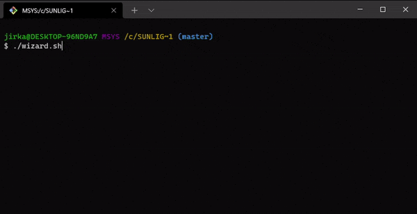

Plugin Wizard
#############

A tool for making Sunlight CMS plugin architecture easier.

.. contents::

Preview
*******

Requirements
************

- `Git Bash <https://git-scm.com/>`_

Usage
*****

#. Download (and extract)
#. Copy the ``wizard.sh`` file to the root of the Sunlight CMS project
#. Run ``./wizard.sh`` command in bash
#. Follow the on-screen instructions.
